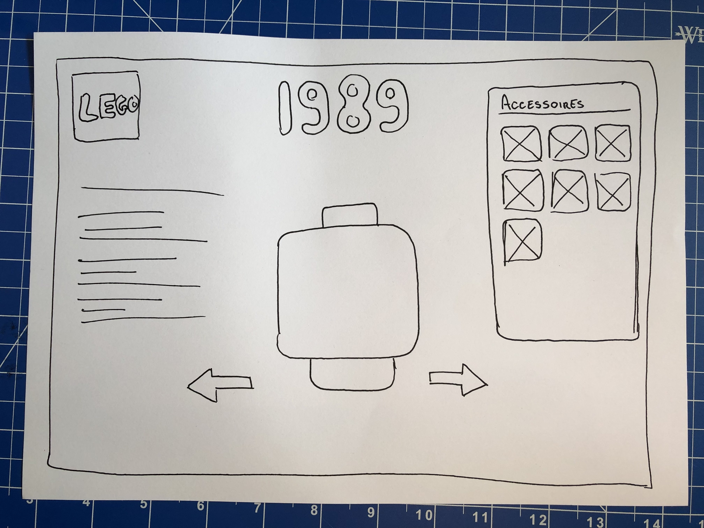
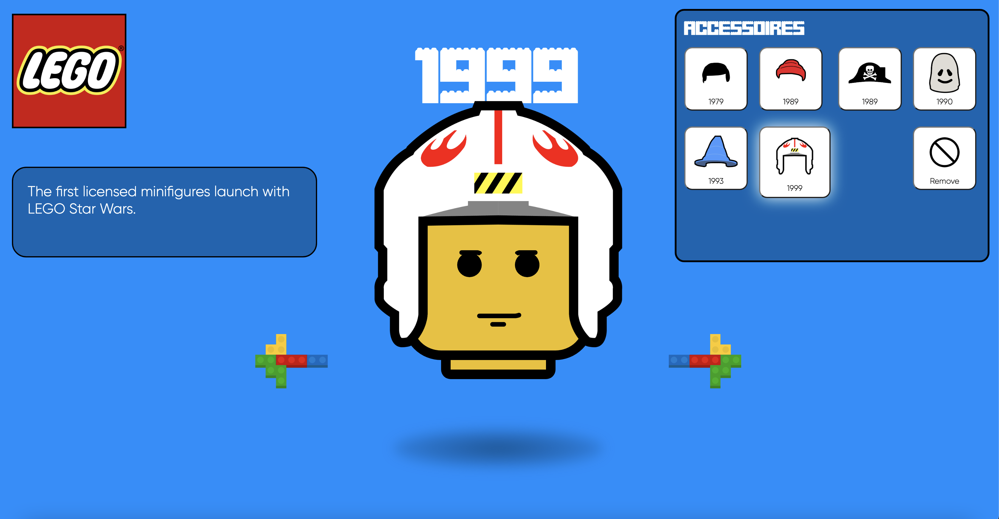
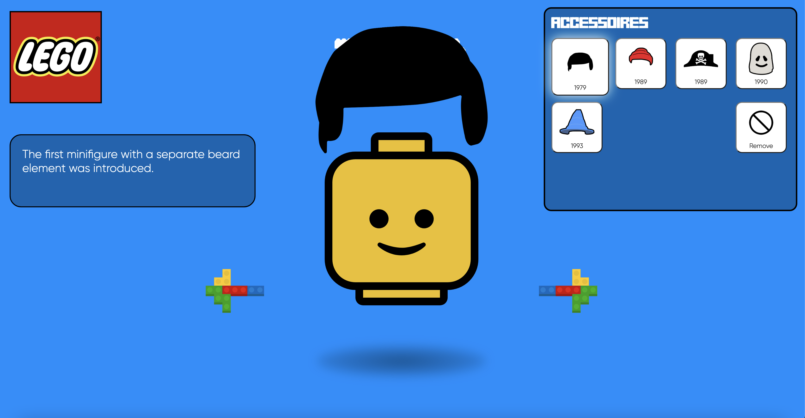
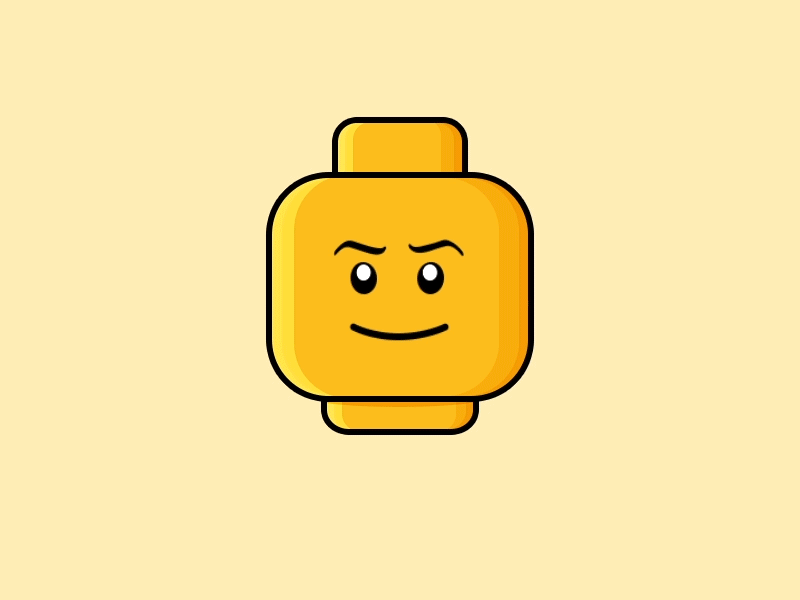

# Procesverslag
Markdown is een simpele manier om HTML te schrijven.  
Markdown cheat cheet: [Hulp bij het schrijven van Markdown](https://github.com/adam-p/markdown-here/wiki/Markdown-Cheatsheet).

Nb. De standaardstructuur en de spartaanse opmaak van de README.md zijn helemaal prima. Het gaat om de inhoud van je procesverslag. Besteedt de tijd voor pracht en praal aan je website.

Nb. Door *open* toe te voegen aan een *details* element kun je deze standaard open zetten. Fijn om dat steeds voor de relevante stuk(ken) te doen.

## Jij

### Ontwerper:
Jeremy Hansma

#### Je startniveau:
Mijn startniveau is: Rood

# Je plan

  
De eerste versie/schets van je ontwerp & je persoonlijke uitdaging

  ### De eerste versie/schets:
  

  ### Je ambitie:
  Aan deze technieken/punten wil ik werken:
  - Meer Javascript gebruiken (hier heb ik nog weinig ervaring mee)
  - Veel animaties

## Voortgang/Feedback 1

  
Mijn bevindingen + wijzigingen (minimaal 5)

  Bij het eerste feedback moment was er nog niet veel wat ik had qua idee. Ik wist alleen dat ik me wou focussen op de LEGO minifigures door de jaren heen en hier had ik een eerste ontwerp voor gemaakt. Uit deze feedback sessie kreeg ik enorm veel ideeën die ik uiteindelijk heb uitgewerkt, namelijk:
  - Het zelf kunnen toevoegen van accessoires per jaar.
  - Geluidseffecten als er een hoedje op het hoofd klikt.
  - Bij de hoofdjes en de accessoires het jaartal wanneer ze uitkwamen vermelden.

## Reflectie

  
Mijn eindresultaat & persoonlijke ontwikkeling

  ### Je uitkomst - karakteristiek screenshot(s):
  
  Ik ben erg tevreden met mijn uiteindelijke resultaat! Het ziet er (vind ik) mooi uit en het is meer dan ik aan het begin van het vak dacht dat ik kon met code. Ik vind het erg jammer dat ik door mijn ziekenhuisbezoek een aantal lessen heb gemist en hierdoor ook wat feedback momenten heb gemist.

  ### Dit ging goed/Heb ik geleerd:
  Korte omschrijving met plaatje(s)

  
  Ik ben vooral trots op mijn animaties. Alles werkt soepel en het ziet er mooi uit. Ook ben ik blij met mijn kleurgebruik op de hele website, het past heel erg bij LEGO.

  ### Dit was lastig/Is niet gelukt:
  Korte omschrijving met plaatje(s)

  
  Er is zo ontzettend veel wat ik nog had willen maken en wat beter had gekunt. Hierdoor heb ik wel super veel geleerd en zal ik dit in de toekomst anders aanpakken. Een aantal voorbeelden van dingen die ik nog had willen doen:
  - Ik had eigenlijk nog het hoofdje willen laten draaien als je naar een ander jaar gaat.
  - Een dark mode knop.
  - Meer jaartallen en accessoires.
  - Een state voor de accessoire button als die op het hoofdje zit.
  - Een animatie voor als een accessoire van het hoofdje gaat.
  - Paaseitjes!
  - Meer feedback en een betere ReadMe :/

## Bronnenlijst

continu bijhouden terwijl je werkt

Nb. Wees specifiek ('css-tricks' als bron is bijv. niet specifiek genoeg).

1. https://stackoverflow.com/questions/18826147/javascript-audio-play-on-click
2. https://javascript.plainenglish.io/how-to-detect-arrow-key-presses-in-javascript-2c38192de0e8
3. https://www.brothers-brick.com/2018/08/31/the-minifigure-turns-40-a-colorful-history/lego-minifigure-40-years-infographic/

